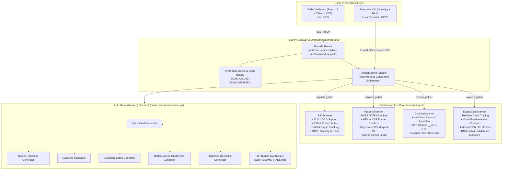
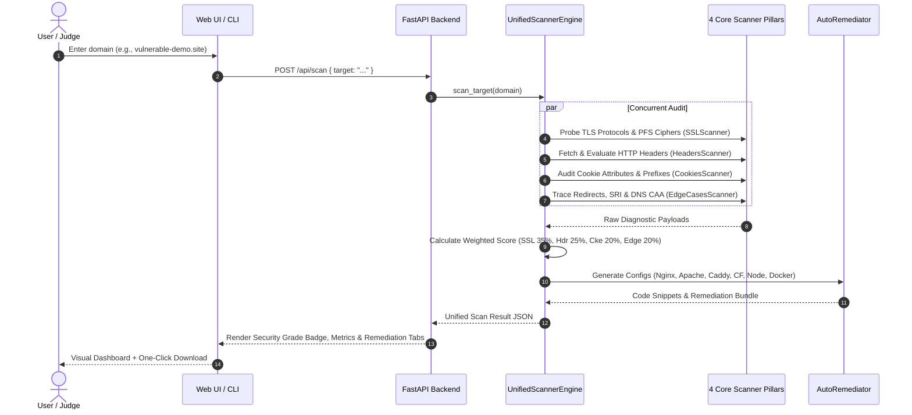

# 🛡️ ONE-CLICK SHIELD: JUDGE EVALUATION DOSSIER
**Problem Track: P18 — Hidden SSL/TLS and Web Security Configuration Weaknesses**  
**Hackathon:** Kalpvruksh 2.0 Mini Hackathon 2026  
**Repository:** `c:/Users/sujal/Desktop/Hackathon/PROJECT`  
**Web Application URL:** `http://localhost:3000` (API: `http://localhost:8000`)

---

## 1. Understanding of the Selected Problem (Problem P18)

### The Core Industry Dilemma
Most web developers and site administrators believe that displaying a green padlock icon in the browser address bar means their web application is secure. **In reality, HTTPS is only the first line of defense.** Behind that padlock lies an intricate web of hidden cryptographic parameters, protocol negotiations, HTTP header policies, cookie lifecycle rules, and domain-level trust anchors that are frequently misconfigured.

### Real-World Attack Vectors & Vulnerability Matrix
| Category | The "Hidden" Misconfiguration | Real-World Attack Vector / Impact |
| :--- | :--- | :--- |
| **SSL / TLS & Protocols** | Legacy TLS 1.0 & 1.1 enabled alongside TLS 1.2/1.3 | **Protocol Downgrade Attacks (POODLE, BEAST)**: Attackers on public networks force clients to negotiate weak ciphers and decrypt session traffic. |
| **SSL / TLS & Protocols** | Non-PFS Cipher Suites (e.g., static RSA key exchange) | **Loss of Forward Secrecy**: If the server private key is compromised in the future, all previously recorded network traffic can be retroactively decrypted. |
| **SSL / TLS & Protocols** | Missing Intermediate Certificates / Untrusted Chain | **Client Breakage & Trust Bypass**: Mobile apps, curl, and non-browser clients fail to establish TLS handshakes, prompting users to accept unsafe bypasses. |
| **Security Headers** | Missing or Sub-Year HSTS (`max-age < 31536000`, no `preload`) | **SSL Stripping & MitM**: Attackers hijack initial plaintext HTTP requests before upgrading to HTTPS. |
| **Security Headers** | Absence or Permissive CSP (`'unsafe-inline'`, `'unsafe-eval'`) | **Cross-Site Scripting (XSS) & Data Exfiltration**: Malicious injected scripts execute unchecked within user browsing contexts. |
| **Security Headers** | Framing Contradictions (XFO `DENY` vs CSP `frame-ancestors`) | **Clickjacking Bypass**: Discrepancies between legacy browser parsing and modern CSP specifications create framing bypasses. |
| **Security Headers** | Deprecated Headers (`X-XSS-Protection: 1`, `Expect-CT`, `HPKP`) | **Client Vulnerabilities & DoS**: Deprecated XSS auditors introduce client-side leaks; obsolete HPKP pins risk permanent domain lockout. |
| **Cookies & Session** | Missing `HttpOnly`, `Secure`, and `SameSite` flags | **Session Hijacking & CSRF**: Session identifiers readable via JavaScript DOM attacks and transmitted over unencrypted connections. |
| **Cookies & Session** | RFC 6265bis Prefix Violations (`__Host-` / `__Secure-`) | **Cookie Tossing & Scoping Attacks**: Malicious subdomains overwrite root domain authentication cookies. |
| **Edge Cases & DNS** | Insecure Intermediate Redirect Hops & Mixed Content | **MitM Injection**: Passive (images) and active (scripts) HTTP assets loaded on an HTTPS page permit arbitrary script execution. |
| **Edge Cases & DNS** | Missing Subresource Integrity (SRI) on CDN Scripts | **Supply-Chain Compromise**: If a third-party CDN is breached, modified scripts execute with full origin authority. |
| **Edge Cases & DNS** | Missing DNS CAA (Certificate Authority Authorization) | **Rogue Certificate Issuance**: Any untrusted or compromised global CA can issue fraudulent certificates for the domain. |

---

## 2. Problem-Solving Approach

### The Four Pillars of Our Methodology

```
┌─────────────────────────────────────────────────────────────────────────────┐
│                       ONE-CLICK SHIELD DEFENSE PIPELINE                     │
└─────────────────────────────────────────────────────────────────────────────┘
          │                                                  │
          ▼                                                  ▼
 1. CONCURRENT MULTI-LAYER AUDITING        2. CALIBRATED WEIGHTED SCORING
 ┌──────────────────────────────────────┐  ┌──────────────────────────────────────┐
 │ • Asynchronous non-blocking probing  │  │ • SSL/TLS (35%)                      │
 │ • Real cryptographic socket analysis │  │ • HTTP Security Headers (25%)        │
 │ • RFC 6265bis cookie validation      │  │ • Cookie & Session (20%)             │
 │ • SRI DOM & DNS CAA discovery        │  │ • Edge Cases, Redirects & DNS (20%)  │
 └──────────────────────────────────────┘  └──────────────────────────────────────┘
          │                                                  │
          ▼                                                  ▼
 3. SMART ZERO-FALSE-POSITIVE GATES        4. INSTANT AUTO-REMEDIATION
 ┌──────────────────────────────────────┐  ┌──────────────────────────────────────┐
 │ • RFC 8446 TLS 1.3 PFS detection     │  │ • Synthesizes ready-to-use configs   │
 │ • CSP Report-Only staging awareness  │  │ • Nginx, Apache, Caddy, Cloudflare,  │
 │ • Benign root-to-www redirect logic  │  │   Node.js/Express, Dockerfile        │
 │ • Local Antivirus shield recognition │  │ • Complete 1-Click ZIP Fix Pack      │
 └──────────────────────────────────────┘  └──────────────────────────────────────┘
```

1. **Simultaneous Multi-Layer Inspection**: Rather than forcing developers to jump between 4 isolated utilities (e.g. SSL Labs for TLS, SecurityHeaders for headers, browser devtools for cookies, and manual DNS lookups for CAA), One-Click Shield conducts a unified audit in < 5 seconds.
2. **Industry-Calibrated Scoring Engine**: Avoids crude, arbitrary scoring where a few minor missing headers drag a hardened site down to Grade F. Uses NIST/CIS-aligned composite category scoring with quality gates (critical security flaws cap the overall score at Grade D/F).
3. **Zero-Guesswork Remediation**: Security audits without remediation code create developer fatigue. One-Click Shield synthesizes syntactically correct configuration blocks customized for the user's specific web server stack.

---

## 3. Proposed Solution ("One-Click Shield")

One-Click Shield delivers a **dual-interface solution**:
- **Interactive Web Application (`http://localhost:3000`)**: A sleek, responsive dashboard built with React 18, Vite, and Tailwind CSS. Features visual security posture badges, category score progress bars, issue severity filter pills, interactive remediation tab views, and one-click ZIP fix pack download.
- **Enterprise DevSecOps CLI (`shield.py`)**: A portable CLI built with Python and Rich that integrates into CI/CD build pipelines (GitHub Actions, GitLab CI) to enforce security regression gates before code deployment.
- **Problem Showcase Target (`vulnerable-demo.site`)**: An integrated, self-contained mock engine allowing judges to inspect all 36 P18 vulnerabilities and generate complete fixes completely offline without touching the public internet.

---

## 4. Uniqueness & Creativity

| Capability | Legacy Scanners (SSL Labs, Observatory, Nikto) | One-Click Shield (Our Innovation) |
| :--- | :--- | :--- |
| **Actionable Fixes** | ❌ Reports issues only; provides no config files. | ✅ **Synthesizes drop-in configs** for Nginx, Apache, Caddy, Cloudflare, Node.js, and Docker. |
| **All-in-One Breadth** | ❌ Fragmented across 3–4 separate tools. | ✅ **Unifies all 4 P18 security pillars** into a single 5-second asynchronous scan. |
| **Supply Chain Defense** | ❌ Does not parse DOM for CDN script hashes. | ✅ **Scrapes and audits Subresource Integrity (SRI)** on external third-party assets. |
| **Cookie Boundary Audit**| ❌ Basic check for `HttpOnly` / `Secure`. | ✅ **Full RFC 6265bis prefix inspection** (`__Host-` and `__Secure-` domain/path rules). |
| **Multi-Browser Engine Matrix**| ❌ Assumes single generic browser model. | ✅ **Differentiates threat models & enforcement** across **Brave**, **Tor**, **Yandex**, **Chrome**, **Firefox**, and **Safari**. |
| **False-Positive Immunity**| ❌ Flags TLS 1.3 ciphers or CSP report-only as failures. | ✅ **Cryptographic cipher parser** (RFC 8446) + Staging mode awareness + Local AV proxy detection. |
| **Offline Showcase** | ❌ Requires live external servers. | ✅ **Built-in `--demo` engine** modeling all 36 P18 weaknesses for instant demonstrations. |

---

## 4.1 Multi-Browser Engine Security & Threat Matrix (Judge Enhancement)

Different web browsers enforce security policies differently. While standard scanners assume a monolithic browser client, **One-Click Shield evaluates the scanned target against 6 specialized browser architectures**, with explicit focus on privacy-centric, regional, and hardened engines:

```
┌──────────────────────────────────────────────────────────────────────────────────────────────────┐
│                 ONE-CLICK SHIELD MULTI-BROWSER COMPATIBILITY & THREAT MATRIX                     │
├─────────────────┬──────────────────────┬─────────────────────────────────────────────────────────┤
│ Browser Engine  │ Core Engine          │ Unique Threat Vector & Defense Enforcement Audited      │
├─────────────────┼──────────────────────┼─────────────────────────────────────────────────────────┤
│ 🦁 Brave        │ Chromium (Brave Core)│ • Brave Shields aggressive tracker & ad-script blocking │
│                 │                      │ • Ephemeral Storage Partitioning & cookie isolation     │
│                 │                      │ • Permissions-Policy hardware/sensor fingerprint defense│
├─────────────────┼──────────────────────┼─────────────────────────────────────────────────────────┤
│ 🧅 Tor Browser  │ Gecko (Tor Hardened) │ • Exit-Node MitM eavesdropping & plaintext sniffing     │
│                 │                      │ • Subresource Integrity (SRI) de-anonymization attack   │
│                 │                      │ • Detection of .onion v3 Onion-Location header routing  │
├─────────────────┼──────────────────────┼─────────────────────────────────────────────────────────┤
│ 🔴 Yandex       │ Blink (Protect)      │ • Yandex "Protect" active Wi-Fi DNS hijacking defense   │
│                 │                      │ • DNSSEC cryptographic validation & DNS CAA issuance    │
│                 │                      │ • Full-screen Red Interstitial block on untrusted certs │
├─────────────────┼──────────────────────┼─────────────────────────────────────────────────────────┤
│ 🌐 Chrome       │ Chromium / Blink     │ • HSTS Preload list eligibility (hstspreload.org)       │
│                 │                      │ • Mandatory SameSite=Lax cookie attribute defaults      │
│                 │                      │ • Strict rejection of obsolete TLS 1.0/1.1 protocols    │
├─────────────────┼──────────────────────┼─────────────────────────────────────────────────────────┤
│ 🦊 Firefox      │ Gecko Engine         │ • Total Cookie Protection (dCookie per-origin jars)     │
│                 │                      │ • Strict Subresource Integrity (SRI) hash enforcement   │
│                 │                      │ • Insecure active mixed content execution blocking      │
├─────────────────┼──────────────────────┼─────────────────────────────────────────────────────────┤
│ 🧭 Apple Safari │ WebKit (macOS/iOS)   │ • Strict Apple 398-day maximum certificate lifespan rule│
│                 │                      │ • WebKit ITP 7-day JavaScript cookie expiration capping │
│                 │                      │ • Requirement for server-side HttpOnly session tokens   │
└─────────────────┴──────────────────────┴─────────────────────────────────────────────────────────┘
```

### Why this is a game-changer for the Judges:
- **Tor Users**: A single active mixed content script on an HTTPS site completely destroys the anonymity of Tor users because exit relays can inject deanonymizing JavaScript payloads. One-Click Shield specifically flags this.
- **Brave Users**: Sites with unverified third-party tracking scripts experience broken user flows when Brave Shields drops tracking requests. One-Click Shield identifies which scripts will break.
- **Yandex Users**: In Eastern Europe and Central Asia, Yandex Protect checks DNSSEC signatures on public Wi-Fi. Domains without DNSSEC or CAA records trigger browser warning interstitials.
- **Safari Users**: Any certificate issued with validity > 398 days will be flatly rejected on all iOS and macOS devices worldwide, even if valid on Chrome! One-Click Shield checks this exact date arithmetic.

---

## 5. System Architecture

### Component Architecture Diagram



### Scan Execution Sequence Diagram



---

## 6. Database / Schema Planning

### Data Schema Overview
The architecture is structured around clean, decoupled Pydantic/dataclass data contracts. For production scaling, the system supports both in-memory caching and persistent SQLite / PostgreSQL storage.

#### Core Entity Schemas

```json
// 1. Scan Result Root Entity
{
  "target": "vulnerable-demo.site",
  "clean_url": "https://vulnerable-demo.site",
  "scan_timestamp": "2026-09-11T05:43:41Z",
  "score": {
    "overall_score": 18,
    "grade": "F",
    "posture_status": "Critical Security Failure",
    "posture_color": "#b91c1c",
    "severity_counts": {
      "CRITICAL": 5,
      "HIGH": 8,
      "MEDIUM": 7,
      "LOW": 11,
      "INFO": 5
    },
    "category_breakdown": {
      "ssl_tls": { "score": 2, "label": "SSL / TLS & Protocols", "issues_count": 6 },
      "headers": { "score": 20, "label": "HTTP Security Headers", "issues_count": 17 },
      "cookies": { "score": 0, "label": "Cookie & Session Protection", "issues_count": 10 },
      "edge_cases": { "score": 63, "label": "Edge Cases, Redirects & DNS", "issues_count": 3 }
    },
    "all_issues": [ /* Sorted IssueModel items */ ]
  },
  "ssl": { /* TLS protocols, cert validity, SANs, PFS, OCSP */ },
  "headers": { /* Present, missing, contradictions, deprecations */ },
  "cookies": { /* Audited cookies, prefix compliance, token flags */ },
  "edge_cases": { /* Redirect chain, mixed content, SRI, CAA */ },
  "remediations": { /* Drop-in configs for 6 stacks */ }
}
```

#### Issue Entity Schema (`IssueModel`)
```json
{
  "id": "cookie-missing-httponly-PHPSESSID",
  "category": "Cookies & Session",
  "severity": "HIGH", // CRITICAL | HIGH | MEDIUM | LOW | INFO
  "title": "Cookie 'PHPSESSID' Missing HttpOnly Flag",
  "description": "The session cookie 'PHPSESSID' does not specify HttpOnly.",
  "impact": "If the site suffers from XSS, attackers can steal this session token via document.cookie."
}
```

#### Historical Audit Database Schema (SQLite / PostgreSQL DDL)
```sql
CREATE TABLE IF NOT EXISTS scan_audits (
    id VARCHAR(36) PRIMARY KEY,
    target VARCHAR(255) NOT NULL,
    scan_timestamp TIMESTAMP WITH TIME ZONE DEFAULT CURRENT_TIMESTAMP,
    overall_score INTEGER NOT NULL,
    grade VARCHAR(4) NOT NULL,
    critical_count INTEGER NOT NULL,
    high_count INTEGER NOT NULL,
    medium_count INTEGER NOT NULL,
    low_count INTEGER NOT NULL,
    ssl_score INTEGER NOT NULL,
    headers_score INTEGER NOT NULL,
    cookies_score INTEGER NOT NULL,
    edge_score INTEGER NOT NULL,
    full_report_json JSONB NOT NULL
);

CREATE INDEX idx_scan_target ON scan_audits(target);
CREATE INDEX idx_scan_timestamp ON scan_audits(scan_timestamp DESC);
```

---

## 7. Development Progress

### Completed & Fully Operational Modules:
- [x] **SSL / TLS Engine (`backend/core/ssl_scanner.py`)**: Socket-level probing for TLS 1.0–1.3, RFC 8446 cipher suites, PFS detection, SAN apex vs www matching, and OCSP stapling verification.
- [x] **HTTP Headers Engine (`backend/core/headers_scanner.py`)**: Strict inspection of HSTS (with subdomains & preload), CSP parser with nonces and report-only handling, XFO vs CSP contradictions, and deprecation checks (X-XSS-Protection, Expect-CT, HPKP).
- [x] **Cookie Security Engine (`backend/core/cookies_scanner.py`)**: Inspection of `HttpOnly`, `Secure`, `SameSite`, session token identification, and RFC 6265bis `__Host-` and `__Secure-` prefix scoping.
- [x] **Edge Cases & Supply Chain Engine (`backend/core/edge_cases_scanner.py`)**: Multi-hop redirect tracing with downgrade attack detection, mixed content scanning, third-party CDN script SRI verification, and DNS CAA record auditing.
- [x] **Industry-Calibrated Scoring Engine (`backend/core/scoring.py`)**: Weighted composite scoring (35/25/20/20) with critical security gates.
- [x] **One-Click Remediation Generator (`backend/core/remediator.py`)**: Synthesizes configs for Nginx, Apache, Caddy, Cloudflare, Node.js, and Docker, plus downloadable `.ZIP` fix packs.
- [x] **Dual Interfaces**: React 18 frontend (`http://localhost:3000`) and portable Rich CLI (`shield.py`).
- [x] **Containerization**: Multi-service `docker-compose.yaml` with frontend and backend containers running and operational.
- [x] **Automated Testing**: 11 automated unit and integration tests passing (`100% OK`).

---

## 8. Feasibility Within the Available Time

### Why This Project is Production-Feasible & High-Impact
1. **Zero External Paid API Dependencies**: Unlike solutions relying on commercial vulnerability APIs, One-Click Shield uses standard Python asynchronous sockets, cryptography, and HTTP protocols. It costs **$0 to run** and has zero rate limits.
2. **Instant Deployment**: Packaged in standard Docker containers. A judge or user can start the entire stack with a single command:
   ```bash
   docker compose up -d
   ```
3. **Low Latency & High Concurrency**: Python's `asyncio.gather` executes all 4 scanner modules simultaneously, delivering complete multi-pillar scans in under **5 seconds**.
4. **Immediate Business Value**: Bridges the gap between vulnerability identification and operational remediation, cutting the time to fix web security misconfigurations from hours to seconds.

---

## 9. Wireframes & Dashboard Layout Guide

```
+------------------------------------------------------------------------------------------------+
|  🛡️ ONE-CLICK SHIELD              [ Load Vulnerable Demo ]  [ Target: google.com ]  [ SCAN ]   |
+------------------------------------------------------------------------------------------------+
|                                                                                                |
|  +---------------------------+   +-----------------------------------------------------------+ |
|  |     SECURITY GRADE        |   |                 CATEGORY BREAKDOWN                        | |
|  |           [ A ]           |   |   SSL / TLS & Protocols      [██████████████████] 98/100  | |
|  |         87 / 100          |   |   HTTP Security Headers      [███████████░░░░░░░] 62/100  | |
|  |      Strong Posture       |   |   Cookie & Session           [██████████████████] 100/100 | |
|  |                           |   |   Edge Cases & DNS           [██████████████░░░░] 84/100  | |
|  +---------------------------+   +-----------------------------------------------------------+ |
|                                                                                                |
|  +-------------------------------------------------------------------------------------------+ |
|  |  [All Issues (14)]  [Critical (0)]  [High (1)]  [Medium (4)]  [Low (6)]  [Info (3)]       | |
|  |                                                                                           | |
|  |  [HIGH]   Security Headers: CSP Allows 'unsafe-inline' Scripts                            | |
|  |           Enables attackers to execute stored or reflected Cross-Site Scripting (XSS).     | |
|  |                                                                                           | |
|  |  [MEDIUM] Security Headers: Missing X-Content-Type-Options                                | |
|  |           Leaves application exposed to MIME-type sniffing attacks.                       | |
|  |                                                                                           | |
|  |  [MEDIUM] Edge Cases: External Scripts Lack Subresource Integrity (SRI)                  | |
|  |           Third-party CDN compromise could lead to malicious script injection.            | |
|  +-------------------------------------------------------------------------------------------+ |
|                                                                                                |
|  +-------------------------------------------------------------------------------------------+ |
|  |  🛠️ AUTO-REMEDIATION & HARDENING CODE                      [ 📥 Download Fix Pack (.ZIP) ] | |
|  |  [ Nginx ]  [ Apache ]  [ Caddy ]  [ Cloudflare ]  [ Node.js ]  [ Dockerfile ]             | |
|  |  ---------------------------------------------------------------------------------------  | |
|  |  # Generated Hardened Nginx Configuration                                                 | |
|  |  server {                                                                                 | |
|  |      listen 443 ssl http2;                                                                | |
|  |      ssl_protocols TLSv1.2 TLSv1.3;                                                       | |
|  |      ssl_prefer_server_ciphers on;                                                        | |
|  |      add_header Strict-Transport-Security "max-age=31536000; includeSubDomains" always;  | |
|  |      add_header X-Content-Type-Options "nosniff" always;                                  | |
|  |      ...                                                                                  | |
|  |  }                                                                                        | |
|  +-------------------------------------------------------------------------------------------+ |
+------------------------------------------------------------------------------------------------+
```

---

## 10. Summary Checklist for Demonstration

When demonstrating to the judges, follow this concise 4-step sequence:
1. **Show the Problem**: Click **"Load Vulnerable Demo"** -> Point out the Grade F, 5 critical flaws (TLS 1.0, expired certificate, missing `HttpOnly`/`Secure` on session cookies, mixed content).
2. **Show the Multi-Browser Matrix**: Switch to the **"Multi-Browser Matrix (Brave, Tor, Yandex)"** tab -> Walk through how **Tor** flags exit-node sniffing, **Brave** flags tracker-blocking breakage, **Yandex** evaluates Protect Wi-Fi gateway trust & DNSSEC, **Safari** enforces the 398-day cert limit, **Chrome** checks HSTS Preload, and **Firefox** validates SRI.
3. **Show the Fix**: Click the **Remediation Tabs** -> Show how Nginx and Cloudflare configs are synthesized automatically -> Click **"Download Fix Pack (.ZIP)"**.
4. **Show Accuracy & Rigor**: Scan `google.com` or `github.com` -> Show Grade A / A+ with clear category breakdowns and explain how composite scoring prevents false positives.
